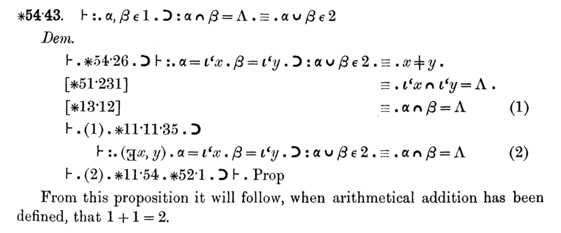

# Dados

LeanDojo: Theorem Proving with Retrieval-Augmented Language Models.

Kaiyu Yang, Aidan M. Swope, Alex Gu, Rahul Chalamala, Peiyang Song, Shixing Yu,
Saad Godil, Ryan Prenger, Anima Anandkumar.

[https://doi.org/10.48550/arXiv.2306.15626](https://doi.org/10.48550/arXiv.2306.15626)

NeurIPS 2023

[https://leandojo.org/](https://leandojo.org/)

# Introdução

No começo do século 20, a matemática sofreu uma *crise de identidade*. O
**Paradoxo de Russell** mostrou que os alicerces nos quais a matemática se
apoiava não eram, no final das contas, tão sólidos.

# Introdução

> Seja $R$ o conjunto de todos os conjuntos que não contém si mesmo.
> Pergunta: $R \in R$?

- Se $R \in R$, então $R$ é um conjunto que contém si mesmo, portanto $R \notin
R$, contradição.
- Se $R \notin R$, então $R$ é um conjunto que não contém si mesmo, portanto $R \in
R$, contradição.

# Introdução

Destaquemos duas saídas que foram concebidas para o problema:

- Teoria Axiomática dos Conjuntos
  - Define um conjunto base de axiomas, e desenvolve a matemática a partir dele
- Teoria de Tipos
  - Define regras gramaticais e semânticas, e desenvolve a matemática a partir delas

# Introdução

Destaquemos duas saídas que foram concebidas para o problema:

- **Teoria Axiomática dos Conjuntos**
  - Define um conjunto base de axiomas, e desenvolve a matemática a partir dele
- Teoria de Tipos
  - Define regras gramaticais e semânticas, e desenvolve a matemática a partir delas

# Introdução - Teoria de Tipos



# Introdução - Teoria de Tipos

Inicialmente não obteve muita fama além do trabalho de Russell, até ser
redescoberta e mais profundamente desenvolvida por Alonzo Church, quando
trabalhava na variante tipada de seu *Cálculo Lambda*.

# Introdução - Isomorfismo de Curry-Howard

Haskell Curry *(sim, esse Haskell!)* e William Howard foram os primeiros a notar
que, com sistemas de tipos fortes o suficiente, **provas matemáticas
correspondem a programas de computador, e vice-versa**.

|Matemática|Programação|
|:-:|:-:|
|$\forall$|tipo $\Pi$|
|$\exists$|tipo $\Sigma$|
|implicação|função|
|$\land$|tipo produto|
|$\lor$|tipo soma|
|proposição verdadeira|tipo unidade (*top*)|
|proposição falsa|tipo vazio (*bottom*)|

# Introdução - Isomorfismo de Curry-Howard

Hoje, com compiladores avançados, esse isomorfismo permite que matemática seja
feita como programas, utilizando código.

Ferramentas que exploram isso são chamadas de *proof assistants* (assistentes de
prova).

# Introdução - Lean

*Lean* é uma dessas ferramentas. É uma linguagem de programação com um sistema
de tipos *dependente* (que permite expressarmos os tipos $\Pi, \Sigma$), que
auxilia na formalização e prova de teoremas.

Exemplo:

\begin{theorem}
    Sejam $X,Y$ espaços topológicos e $f : X \to Y$. Dizemos que $f$ é
    \textbf{contínua} se, para todo $U \subseteq Y$ aberto em $Y$, $f^{-1}(U)$ é
    aberto em $X$.
\end{theorem}

# Introdução - Lean

\begin{theorem}
    Seja $X$ um espaço topológico e $\operatorname{id}_X : X \to X$ sua função
    de identidade. Então, $\operatorname{id}_X$ é uma função contínua.
\end{theorem}

\begin{proof}
    Suponha $X$ um espaço topológico, e seja $U \subseteq X$ um subconjunto
    aberto qualquer. Queremos mostrar que $\operatorname{id}_X^{-1}(U)$ é aberto. De
    fato, basta observar que $\operatorname{id}_X^{-1}(U) = U$, que por hipótese
    é aberto. Portanto, $\operatorname{id}_X$ é contínua.
\end{proof}

# Introdução - Lean

```lean
import topology.basic

variables {X : Type} [topological_space X]

theorem my_identity_cont : continuous (id : X → X) :=
begin
  rw continuous_def,    -- Provaremos pela definição
  intros U U_open,      -- Suponha U aberto de X
  rw set.preimage_id,   -- Temos que id^-1 U = U
  exact U_open,         -- Por hipótese, U é aberto. QED.
end
```

# Introdução - LeanDojo

O LeanDojo observa a capacidade de geração de código a partir de linguagem
natural dos modelos LLM, e faz uma integração com tais modelos para *auxiliar a
formalização e prova de teoremas*.

Isso funciona bem porque, embora LLMs gerem código muitas vezes bom, ainda é um
problema em aberto tratar de alucinações.

Mas como o sistema de tipos é o coração de Lean, é trivial checar se o código
gerado é correto -- *basta verificar se ele compila*.

# Introdução - Problemas

O LeanDojo não é o primeiro projeto que une assistentes de prova a modelos de
linguagem. No entanto, segundo os autores, a grande maioria dos trabalhos já
feitos são **difíceis de reproduzir e usar**, por serem **proprietários** e
usarem **bases de dados privadas**.

Os outros trabalhos também **não são eficientes na escolha dos próximos passos**
durante uma prova. LeanDojo introduz o *ReProver* com a técnica nova de
*retrieval* para mitigar este problema.

# Introdução - LeanDojo


# Principais Pontos

- Base de Dados/Treinamento/Benchmark
- Extração de Dados (interação com o Lean)
- *ReProver* (modelo específico para geração de *tactics*)
- Plugin para o ChatGPT

# Metodologia - Base de Dados

A base de dados foi nomeada de *LeanDojo Benchmark*, e contém principalmente
código e documentação da biblioteca *mathlib*, um grande repositório open-source
de matemática formalizada em Lean.

Para o treinamento do *ReProver*, uma técnica rebuscada de *splitting* foi
usada, de modo a evitar que o modelo seja validado contra teoremas muito
similares aos que foram usados no treinamento, o que causaria tais teoremas a
serem decorados.

# Metodologia - Interação com o Lean

A cada passo numa prova, o Lean gera um conjunto de informações sobre o *estado*
atual da prova -- quais são as hipóteses assumidas até o momento, e qual é o
objetivo (*goal*) daquele instante.

{height=1in}

Para *runtime*, o LeanDojo utiliza esse estado. Para treinamento do *ReProver*,
também extrai outros dados, como a *AST* e informações de nome e localização de arquivo.

Código escrito em Python.

# Metodologia - ReProver

O ReProver é um modelo LLM *fine-tuned* que, dado um estado de prova, tenta
sugerir quais *tactics* utilizar próximo.

Utiliza a técnica de **similaridade** para escolher o próximo passo. Obviamente,
por baixo dos panos faz tokenização e *encoding* para uma representação vetorial relevante.

A utilização da similaridade dos textos usados como estado para melhor escolher
o próximo passo é o que caracteriza o ReProver como *retrieval-augmented*, e é
uma das ideias originais do artigo.

Código escrito em Python, utilizando a biblioteca `transformers`.

# Metodologia - ReProver


# Metodologia - Plugin para o ChatGPT

Integração direta entre o ChatGPT e o LeanDojo.

Permite "dirigir" o LeanDojo utilizando linguagem natural, possibilitando a
demonstração de teoremas escritos em matemática formal.

# {.plain}


# Resultados

Modelo *fine-tuned* consegue performance melhor que o *GPT-4* padrão, e muito
melhor que o gerador de provas *tidy* (que usa algoritmo clássico).

A performance é medida a partir do dataset *LeanDojo Benchmark*, e é a
porcentagem de teoremas que foram provados com sucesso.


# Conclusões

O LeanDojo é uma ferramenta útil para se explorar a utilização de inteligência
artificial como auxílio na produção de matemática. 

Além da ferramenta em si, o artigo disponibiliza a sua base de dados para
utilização livre em outros desenvolvimentos.

Ainda, o ReProver serve como base para futuros desenvolvimentos utilizando
*retrieval* para assistentes de prova.
